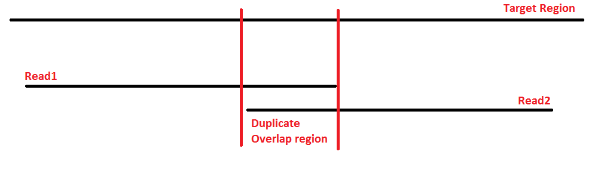

```{r setup, include=FALSE}
knitr::opts_chunk$set(echo = TRUE)
```

<br>
<br>

In this tutorial, you will learn how to go from raw sequencing files in `fastq` format through alignment files in `bam` format that we can use for downstream analysis. Along the way, you will perform multiple quality control (QC) procedures, and will map the short sequences to a snippet of a reference genome. 

<br>


# Case study for practicals

Throughout this course, you will be working with data from the Atlantic silverside, *Menidia menidia*, a small estuarine fish.


The Atlantic silverside is distributed along the east coast of North America and shows a remarkable degree of local adaptation in growth rates and a suite of other traits (Conover et al. 2005). You will be exploring patterns of genomic variation across the species range, which spans one of the steepest thermal gradient in the world. 

### Today's data
Today, we will work with subsets of two different fastq files from each of three Atlantic silversides used in recent studies of fisheries-induced evolution (Therkildsen et al. 2019) and local adaptation (Wilder et al. 2020). The samples we'll use today originate from the MAQU and PANY populations shown in this map:

<br>

```{r, echo=FALSE,out.width="49%", out.height="20%"}
knitr::include_graphics("../img/Silverside_Sample_Map.png") 
```

<br>

The libraries were prepared as described in Therkildsen and Palumbi (2017) and sequenced with 125bp paired-end reads on an Illumina HiSeq instrument. There are two different fastq files for each individual because our libraries were sequenced in two different sequencing runs, to even out sequence coverage among individuals (as discussed in lecture). 

We will map these raw sequence files to a snippet of the sparkling new Atlantic silverside genome (Tigano et al. nearly submitted!). To minimize computational time, we are just working with a small 2 Mb section of chromosome 24 for all the exercises in this course.

<br>

<span style='font-size:75%'> **References:**

<span style='font-size:75%'> Conover, D. O., Arnott, S. A., Walsh, M. R., & Munch, S. B. (2005). Darwinian fishery science: lessons from the Atlantic silverside (Menidia menidia). Canadian Journal of Fisheries and Aquatic Sciences, 62(4), 730–737. http://doi.org/10.1139/f05-069

<span style='font-size:75%'> Therkildsen, N. O., & Palumbi, S. R. (2017). Practical low-coverage genomewide sequencing of hundreds of individually barcoded samples for population and evolutionary genomics in nonmodel species. Molecular Ecology Resources, 17(2), 194–208. http://doi.org/10.1111/1755-0998.12593

<span style='font-size:75%'> Therkildsen, N. O., Wilder, A. P., Conover, D. O., Munch, S. B., Baumann, H., & Palumbi, S. R. (2019). Contrasting genomic shifts underlie parallel phenotypic evolution in response to fishing. Science, 365(6452), 487–490. http://doi.org/10.1126/science.aaw7271

<span style='font-size:75%'> Wilder, A. P., Palumbi, S. R., Conover, D. O., and Therkildsen, N. O. 2020. Footprints of local adaptation span hundreds of linked genes in the Atlantic silverside genome. Evolution Letters 9:177. https://doi.org/10.1002/evl3.189

</span>

<br>
<br>

# Initial preparation

## 1. Make sure you're up to speed on basic shell scripting

We'll be working almost exclusively through the command line, so if you have not used shell scripting before or are getting rusty on it, it may be helpful to have a look at a tutorial like [this one](https://linuxconfig.org/bash-scripting-tutorial-for-beginners) or a cheat sheet like [this one](https://bioinformaticsworkbook.org/Appendix/Unix/UnixCheatSheet.html#gsc.tab=0) before proceeding to the next step. 


<br>

## 2. Copy the working directories with the needed input files

Let's first get set up and retrieve a copy the data we will be working on. First let's create an `exercises` directory, and copy the `day1` directory from `~/Share`. 

```{bash, eval = FALSE}

mkdir exercises
cd exercises

cp -r ~/Share/day1 .

# Go into your new day1 directory and examine its contents
cd day1
ls

# Check the path to your copy of the day1 directory - you will need to enter this as your BASEDIR variable below
pwd

```

<br>

Your own copy of the `day1` directory will be referred to as `BASEDIR` in many of the scripts below. Have a look inside; `day1` contains the following subdirectories:
  
  * `raw_fastq` has the raw fastq files we'll be working on today
  
  * `adapter_clipped` is empty, but you'll use it for storing your adapter clipped fastq files
  
  * `bam` is empty, but you'll use it for storing your bam (alignment) files
  
  * `sample_lists` is for storing sample tables, sample lists, and other small text files
  
  * `fastqc` is empty, but you'll use it for storing your FastQC output
  
  * `reference` currently contains the reference genome file and a list of adapter sequences
  
  * `scripts` is for storing scripts

<br>

> Hint: We move between directories using the `cd` command and can view the content of directories with the `ls` command in the Unix shell.

<br>

## 3. Orient yourself to the formatting of our fastq table and fastq list

When we get data files back from the sequencing center, the files often have obscure names, so we need a data table that let's us link those file names to our sample IDs and other information. Often, part of the fastq file name will be identical among all samples in a run and part of it will reflect some kind of unique sample identifier (either a name you supplied or a name given by the sequencing center). As an example, look in the `day1/raw_fastq` folder and notice how all the files end in either `_1.fastq.gz` or `_2.fastq.gz` (these are the forward and reverse sequences) while the first part of the file names differs (the unique sample identifier). We call the sample identifier the `prefix`.

Our pipeline is set up to link up these `prefix` names with sample details based on a fastq table set up as the example you can find in `day1/sample_lists/fastq_table.tsv`.

For our scripts below to work, the sample table has to be a **tab deliminated** table with the following six columns, strictly in this order:

  * `prefix` the prefix of raw fastq file names
  
  * `lane_number` lane number; each sequencing lane or batch should be assigned a unique identifier
  
  * `seq_id` sequence ID; this variable is only relevant when different libraries were prepared out of the same sample and were run in the same lane (e.g. if you wanted to include a replicate). In this case, seq_id should be used to distinguish these separate libraries. If you only have a single library prepared from each of your samples (even if you sequence that same library across multiple lanes), you can just put 1 for all samples in this column.

  * `sample_id` sample ID; a unique identifier for each individual sequenced
  
  * `population` population name; the population or other relevant grouping variable that the individual belongs to 
  
  * `data_type` data type; there can only be two possible entries: `pe` (for paired-end data) or `se` (for single end data). We need this in the table because for some of our processing steps, the commands are slightly different for paired-end and single-end data.

It is important to make sure that the combination of sample_id, seq_id, and lane_number is unique for each fastq file. 

<br>

We'll also use a second file that we call a fastq list. This is simply a list of prefixes for the samples we want to analyze. Our sample table can contain data for all individuals in our study, but at any given time, we may only want to perform an operation on a subset of them. Like today, in the interest of time, we only want to run 6 sets of fastq files through each processing step. 

Have a look at the list we'll be using in `day1/sample_lists/fastq_list.txt` and note that it's just a list of fastq name prefixes, each on a separate line and there should be no header in this file.

<br>

### Activity
Compare the `fastq_list.txt` to the `fastq_table.txt`. Which populations to the samples we'll be analyzing today originate from?

<br>

With our small fastq table and fastq list here, we can easily look this up manually. But if we have hundreds of samples, that becomes more cumbersome. Let's automate the sample lookup with our first `for loop`.

<br>

## 4. Make sure you're familiar with `for loops` and how to assign and call variables in bash

In low-coverage whole genome sequencing datasets, we'll typically have data from hundreds of individuals, so we need an efficient way to process all of these files without having to write a separate line of code for each file. `for loops` are a powerful way to achieve this, and we will be using them in every step of our pipeline, so let's first take a moment to make sure we understand the syntax.

A ‘for loop’ is a bash programming language statement which allows code to be repeatedly executed. If you've never worked with `for loops` in bash before, it might be helpful to look over a tutorial, e.g. [this one from Software Carpentry](https://swcarpentry.github.io/shell-novice/05-loop/index.html).

Some key extracts from that tutorial here:

The basic syntax of a `for loop` is as follows

```{bash, eval = FALSE}

for thing in list_of_things; do    # ; is equivalent to an end-of-line. We can alternatively put "do" on its own line

    operation_using $thing    # Indentation within the loop is not required, but aids legibility

done

```

When the shell sees the keyword for, it knows to repeat a command (or group of commands) once for each item in a list. Each time the loop runs (called an iteration), an item in the list is assigned in sequence to the variable, and the commands inside the loop are executed, before moving on to the next item in the list. Inside the loop, we call for the variable’s value by putting `$` in front of it. The `$` tells the shell interpreter to treat the variable as a variable name and substitute its value in its place, rather than treat it as text or an external command.

<br>

## 5. Practice using bash `for loops` to iterate over target samples
First, let's just look up the sample IDs. For each prefix in our `fastq_list.txt` will use `grep` to extract the relevant line from the fastq table, use `cut` to extract the column with sample ID, and then `echo` to print the sample ID 

```{bash, eval = FALSE}

BASEDIR=~/exercises/day1/ # Path to the base directory / project directory.

SAMPLELIST=$BASEDIR/sample_lists/fastq_list.txt # Path to a list of prefixes of the raw fastq files. It should be a subset of the the 1st column of the fastq table.

SAMPLETABLE=$BASEDIR/sample_lists/fastq_table.tsv # Path to a fastq table where the 1st column is the prefix of the raw fastq files. The 4th column is the sample ID. 


for SAMPLEFILE in `cat $SAMPLELIST`; do   # Loop through each of the prefixes listed in our fastq list
	
	# For each prefix, extract the associated sample ID (column 4) from the table
	SAMPLE_ID=`grep -P "${SAMPLEFILE}\t" $SAMPLETABLE | cut -f 4` 

	echo $SAMPLEFILE refers to sample $SAMPLE_ID
	
done

```

<br>

### Exercise 
Now change the `for loop` so it also outputs which population each fastq file has data for.

<br>

#### See a solution
<details>
  <summary>Click here to expand</summary>
  
```{bash, eval = FALSE}

for SAMPLEFILE in `cat $SAMPLELIST`; do   # Loop through each of the prefixes listed in our sample list
	
	# For each prefix, extract the associated sample ID (column 4) and population ID (column 5) from the table
	SAMPLE_ID=`grep -P "${SAMPLEFILE}\t" $SAMPLETABLE | cut -f 4` 
	POPULATION=`grep -P "${SAMPLEFILE}\t" $SAMPLETABLE | cut -f 5` 

	echo $SAMPLEFILE refers to sample $SAMPLE_ID from $POPULATION
	
done

```

</details>


<br>

## 6. Define paths to the project directory and programs

We need to make sure the server knows where to find the programs we'll be running and our input and output directories. This will always need to be specified every time we run our scripts in a new login session.

<br>

### Set the project directory as a variable named `BASEDIR`

> Hint: Use `pwd` to check the path to where you copied your day1 folder to and change the `~/exercises/day1/` part in the following line if that is not the correct path to your base directory

```{bash, eval = FALSE}

BASEDIR=~/exercises/day1/ # Note that no spaces are allowed!

```

<br>

### Specify the paths to required programs as variables

When running these scripts on the Physalia server, run the following:

```{bash, eval = FALSE}

FASTQC=fastqc
TRIMMOMATIC=trimmomatic
PICARD=~/Share/picard-2.23.8/picard.jar
SAMTOOLS=samtools
BOWTIEBUILD=bowtie2-build
BOWTIE=bowtie2
BAMUTIL=bam
JAVA=java

```

<br>
If you will be running these programs on a different system, you will have to specify the paths to the different programs on that system (or add them to your $PATH).

<br>
<br>

# Data processing pipeline

Now let's get started processing the data!

<br>

## Examine the raw fastq files

### fastq file structure

A FASTQ file normally contains four lines per sequence.

  * Line 1 contains the sequence identifier, with information on the sequencing run and the cluster. The exact content of this line varies depending on how fastq files are generated from the sequencer.
  * Line 2 is the raw sequence. 
  * Line 3 often consists of a single `+` symbol. 
  * Line 4 encodes the quality of each base in the sequence in Line 2 (i.e. the probability of sequencing error in log scale). For most current sequencers, these base qualities are encoded in the [Phred33 format](https://drive5.com/usearch/manual/quality_score.html), but always check to make sure how your quality scores are encoded. 

Now read the code below, guess what it does, and run it on your own. Does it do what you expect it to do? Inspect the output and try to identify the group of four lines for each read. 

> Hint: make sure that you have changed the `BASEDIR` path to your own base directory.

<br>

```{bash, eval = FALSE}

SAMPLELIST=$BASEDIR/sample_lists/fastq_list.txt # Path to the sample list.
RAWFASTQSUFFIX1=_1.fastq.gz # Suffix to raw fastq files. Use forward reads with paired-end data.

for SAMPLE in `cat $SAMPLELIST`; do

  echo $SAMPLE
  zcat $BASEDIR'/raw_fastq/'$SAMPLE$RAWFASTQSUFFIX1 | head -n 8
  echo ' '

done

```

<br>

### Evaluate the overall data quality

With a new batch of data, it is always to good idea to start out by getting an overview of the data quality and look for any signs of quality issues. The [FastQC](https://www.bioinformatics.babraham.ac.uk/projects/fastqc/) program provides a useful set of diagnostics, so we'll run it on each on our fastq files to check their quality. In the interest of time, we will only look at three of our fastqs. We'll loop over each of these and call FastQC on the forward file only (it only takes the path to the input and the path to where you want the output as parameters). When working with your own data, always make sure to look both at the forward and reverse files because sometimes issues can arise in only one of the read directions.


<br>

```{bash, eval = FALSE}

SAMPLELIST=$BASEDIR/sample_lists/fastq_list.txt # Path to the sample list.
RAWFASTQSUFFIX1=_1.fastq.gz # Suffix to raw fastq files. We'll only look at the forward reads here

for SAMPLE in `cat $SAMPLELIST | head -n 3`; do  # The head -n 3 is taking just the first three elements of our fastq list to loop over

  $FASTQC $BASEDIR'/raw_fastq/'$SAMPLE$RAWFASTQSUFFIX1 -o $BASEDIR'/fastqc/'
  
done

```

<br>


If the program ran, you should now see the output (in html format and a zip file with various files) in your `day1/fastqc` directory. To view the .html, use `scp` (as described [here](https://github.com/nt246/physalia-lcwgs/blob/main/server_log_in.md)) or FileZilla to transfer the html output files to your local machine and open them in a web browser.

If you're not able to download your own files, you can have a look at our's [here](https://github.com/nt246/physalia-lcwgs/tree/main/day_1/fastqc). we are keeping them in our GitHub repo, but GitHub doesn't render .html files, so to view the output, click on the output.html file you want to view, copy its URL and paste it into [this handy viewer](https://htmlpreview.github.io/) to see it in rendered html format.

<br>

#### Question: 
Do you notice anything different about the fastQC reports from the three different fastq files?

<br>

The libraries for these samples were prepared in different batches. Below are representative Bioanalyzer traces for each of the batches. Which sample do you think came from which batch?

<br>

```{r, echo=FALSE,out.width="49%", out.height="20%",fig.cap="Library fragment size distributions",fig.show='hold',fig.align='center'}

knitr::include_graphics(c("../img/Bioanalyzer_Batch1.png","../img/Bioanalyzer_Batch2.png")) 

```

<br>
<br>

## Adapter clipping

When the insert length of a library fragment is shorter than the read length, the sequencer will read into the adapter sequence (as shown below). This means that the end of the read will not be from our actual sample, but will be adapter sequence, which may lead to lower alignment performance and even biases in the result if not removed.  


<br>

We saw in our FastQC report that we have substantial adapter content in some of our libraries, so will will need to clip that off. Here, we use [Trimmomatic](http://www.usadellab.org/cms/?page=trimmomatic) to clip the adapter sequence off the ends of reads where they appear. This step requires us to input the known adapter sequences that we used when preparing the libraries (`ADAPTERS`). In this exercise, the libraries were prepared using Illumina's Nextera adapters (sequences listed in NexteraPE_NT.fa). 

Look over the code below. The first block of text specifies which files we are using as input. Then we start looping over our samples. Within the loop, the first step is to extract the relevant sample data from our sample table and assign those as temporary variables. Then we have two `if statements` to call the program with slightly different parameters for paired-end and single-end data. Trimmomatic has lots of different filtering modules. Here we only clip sequence that match to our adapter sequence and remove reads that end up being <40bp after clipping.

<br>

```{bash, eval = FALSE}

SAMPLELIST=$BASEDIR/sample_lists/fastq_list.txt # Path to a list of prefixes of the raw fastq files. It should be a subset of the the 1st column of the sample table.
SAMPLETABLE=$BASEDIR/sample_lists/fastq_table.tsv # Path to a sample table where the 1st column is the prefix of the raw fastq files. The 4th column is the sample ID, the 2nd column is the lane number, and the 3rd column is sequence ID. The combination of these three columns have to be unique. The 6th column should be data type, which is either pe or se. 
RAWFASTQDIR=$BASEDIR/raw_fastq/ # Path to raw fastq files. 
RAWFASTQSUFFIX1=_1.fastq.gz # Suffix to raw fastq files. Use forward reads with paired-end data.
RAWFASTQSUFFIX2=_2.fastq.gz # Suffix to raw fastq files. Use reverse reads with paired-end data. 
ADAPTERS=$BASEDIR/reference/NexteraPE_NT.fa # Path to a list of adapter/index sequences.

## Loop over each sample
for SAMPLEFILE in `cat $SAMPLELIST`; do
	
	## Extract relevant values from a table of sample, sequencing, and lane ID (here in columns 4, 3, 2, respectively) for each sequenced library
	SAMPLE_ID=`grep -P "${SAMPLEFILE}\t" $SAMPLETABLE | cut -f 4`
	POP_ID=`grep -P "${SAMPLEFILE}\t" $SAMPLETABLE | cut -f 5`
	SEQ_ID=`grep -P "${SAMPLEFILE}\t" $SAMPLETABLE | cut -f 3`
	LANE_ID=`grep -P "${SAMPLEFILE}\t" $SAMPLETABLE | cut -f 2`
	SAMPLE_UNIQ_ID=$SAMPLE_ID'_'$POP_ID'_'$SEQ_ID'_'$LANE_ID  # When a sample has been sequenced in multiple lanes, we need to be able to identify the files from each run uniquely
	
	## Extract data type from the sample table
	DATATYPE=`grep -P "${SAMPLEFILE}\t" $SAMPLETABLE | cut -f 6`
	
	## The input and output path and file prefix
	RAWFASTQ_ID=$RAWFASTQDIR$SAMPLEFILE
	SAMPLEADAPT=$BASEDIR'/adapter_clipped/'$SAMPLE_UNIQ_ID
	
	## Adapter clip the reads with Trimmomatic
	# The options for ILLUMINACLIP are: ILLUMINACLIP:<fastaWithAdaptersEtc>:<seed mismatches>:<palindrome clip threshold>:<simple clip threshold>:<minAdapterLength>:<keepBothReads>
	# The MINLENGTH drops the read if it is below the specified length in bp
	# For definitions of these options, see http://www.usadellab.org/cms/uploads/supplementary/Trimmomatic/TrimmomaticManual_V0.32.pdf
	
	if [ $DATATYPE = pe ]; then
		$TRIMMOMATIC PE -threads 1 -phred33 $RAWFASTQ_ID$RAWFASTQSUFFIX1 $RAWFASTQ_ID$RAWFASTQSUFFIX2 $SAMPLEADAPT'_adapter_clipped_f_paired.fastq.gz' $SAMPLEADAPT'_adapter_clipped_f_unpaired.fastq.gz' $SAMPLEADAPT'_adapter_clipped_r_paired.fastq.gz' $SAMPLEADAPT'_adapter_clipped_r_unpaired.fastq.gz' 'ILLUMINACLIP:'$ADAPTERS':2:30:10:1:true MINLENGTH:40' 
	
	elif [ $DATATYPE = se ]; then
		$TRIMMOMATIC SE -threads 1 -phred33 $RAWFASTQ_ID$RAWFASTQSUFFIX1 $SAMPLEADAPT'_adapter_clipped_se.fastq.gz' 'ILLUMINACLIP:'$ADAPTERS':2:30:10 MINLENGTH:40'
	fi
	
done

```

<br>

Have a look at the output printed to the screen and we're iterating over the samples. Note the first time it says 

`TrimmomaticPE: Started with arguments:`

Following this, you will see that actual variable names that were added to the command in each iteration of our loop (e.g. what `$RAWFASTQ_ID$RAWFASTQSUFFIX1` expanded to (was value was assigned to this variable)).

Also examine the section that says
`ILLUMINACLIP: Using 2 prefix pairs, 8 forward/reverse sequences, 0 forward only sequences, 0 reverse only sequences
Input Read Pairs:`

This will show how many reads were removed from our filtering. 

#### Question
The first three samples are the samples for which we examined the FastQC outputs. Do you expect different amount of sequence getting removed from each of these? Is that what you see? Why/Why not?

<br>

Discuss first, then you can check here for a hint

<details>
  <summary>Click here to view the R code</summary>
  
<br>

The output from Trimmomatic only shows how many full reads get removed, not how much the reads within the file get truncated. In the library with lots of adapter, many of the reads will now be shorter, but as long as they're still longer than our threshold of 40bp, they will not get removed. If we wanted to know how much sequence we lost from each fastq, counting the number of bases lost is more informative than the number of sequences. It is also always a good idea to check the adapter clipped fastq files with FastQC to make sure that you did in fact get rid of the adapter sequence. We don't have time to do this in class, but if you're interested, you can use the fastqc loop above and just change it to run on the files in your `adapter_clipped` folder.

</details>

<br>
<br>


## OPTIONAL: Quality trimming
As we saw in our FastQC output, the base call quality score tends to drop off towards the ends of the reads. As we'll learn more about tomorrow, probabilistic analysis frameworks, like `angsd` and others based on genotype likelihoods, can take the basecall quality into account and that way give less weight to a basecall that is less certain.

However, as a conservative measure, we may want to just trim off the rest of the read if the quality score drops too low over multiple bases. We can do this with the `SLIDINGWINDOW` module in [Trimmomatic](http://www.usadellab.org/cms/uploads/supplementary/Trimmomatic/TrimmomaticManual_V0.32.pdf). We won't have time to do that in this practical, but if you're interested, you can modify the Trimmomatic code above to also trim off low-quality bases.

<br>
<br>

## Build reference index files 

There are lots of different programs developed for mapping short reads to a reference sequence. We will use the program [bowtie2](http://bowtie-bio.sourceforge.net/bowtie2/index.shtml). This program requires a set of reference index files to be able to perform the sequence alignment. So we will start by indexing our reference.

<br>

```{bash, eval = FALSE}

REFERENCE=$BASEDIR/reference/mme_physalia_testdata_chr24.fa   # This is a fasta file with the reference genome sequence we will map to 
REFBASENAME="${REFERENCE%.*}"
$SAMTOOLS faidx $REFERENCE

java -jar $PICARD CreateSequenceDictionary R=$REFERENCE O=$REFBASENAME'.dict'

$BOWTIEBUILD $REFERENCE $REFBASENAME

```

<br>
<br>

## Map to the reference, sort, and quality filter

In this step, we align the short reads within each fastq file to the reference genome using `bowtie2`. The resulting alignment file, in `sam` format, will be converted to a binary format `bam` for more efficient storage. Each mapped read will have a mapping quality, which indicates how confident that mapper is that a read is mapped in the correct position. The [bowtie2 manual](http://bowtie-bio.sourceforge.net/bowtie2/manual.shtml) defines it as "a non-negative integer Q = -10 log10 p, where p is an estimate of the probability that the alignment does not correspond to the read's true point of origin." Accordingly, a mapping quality (or MAPQ) of 10 or less indicates that there is at least a 1 in 10 chance that the read truly originated elsewhere, and a MAPQ of 20 indicates at least a 1 in 100 chance.

Here, to only retain reads for which we are reasonably certain have been mapped in the correct place, we will filter out reads with a mapping quality lower than 20, and after that sort the filtered alignment file for easier computation in the next step. 

Look over the code and make sure you understand what it's doing, then copy and run it.

<br>

```{bash, eval = FALSE}

SAMPLELIST=$BASEDIR/sample_lists/fastq_list.txt # Path to a list of prefixes of the raw fastq files. It should be a subset of the the 1st column of the sample table.
SAMPLETABLE=$BASEDIR/sample_lists/fastq_table.tsv # Path to a sample table where the 1st column is the prefix of the raw fastq files. The 4th column is the sample ID, the 2nd column is the lane number, and the 3rd column is sequence ID. The combination of these three columns have to be unique. The 6th column should be data type, which is either pe or se. 
FASTQDIR=$BASEDIR/adapter_clipped/ # Path to the directory where fastq file are stored. 
FASTQSUFFIX1=_adapter_clipped_f_paired.fastq.gz # Suffix to fastq files. Use forward reads with paired-end data. 
FASTQSUFFIX2=_adapter_clipped_r_paired.fastq.gz # Suffix to fastq files. Use reverse reads with paired-end data. 
MAPPINGPRESET=very-sensitive # The pre-set option to use for mapping in bowtie2 (very-sensitive for end-to-end (global) mapping [typically used when we have a full genome reference], very-sensitive-local for partial read mapping that allows soft-clipping [typically used when mapping genomic reads to a transcriptome]
REFERENCE=$BASEDIR/reference/mme_physalia_testdata_chr24.fa # Path to reference fasta file and file name
REFNAME=mme_physalia_testdata_chr24 # Reference name to add to output files, e.g. gadMor2

## Loop over each sample
for SAMPLEFILE in `cat $SAMPLELIST`; do
	
	## Extract relevant values from a table of sample, sequencing, and lane ID (here in columns 4, 3, 2, respectively) for each sequenced library
	SAMPLE_ID=`grep -P "${SAMPLEFILE}\t" $SAMPLETABLE | cut -f 4`
	POP_ID=`grep -P "${SAMPLEFILE}\t" $SAMPLETABLE | cut -f 5`
	SEQ_ID=`grep -P "${SAMPLEFILE}\t" $SAMPLETABLE | cut -f 3`
	LANE_ID=`grep -P "${SAMPLEFILE}\t" $SAMPLETABLE | cut -f 2`
	SAMPLE_UNIQ_ID=$SAMPLE_ID'_'$POP_ID'_'$SEQ_ID'_'$LANE_ID  # When a sample has been sequenced in multiple lanes, we need to be able to identify the files from each run uniquely
	
	## Extract data type from the sample table
	DATATYPE=`grep -P "${SAMPLEFILE}\t" $SAMPLETABLE | cut -f 6`
	
	## The input and output path and file prefix
	SAMPLETOMAP=$FASTQDIR$SAMPLE_UNIQ_ID
	SAMPLEBAM=$BASEDIR'/bam/'$SAMPLE_UNIQ_ID
	
	## Define platform unit (PU), which is the lane number
	PU=`grep -P "${SAMPLEFILE}\t" $SAMPLETABLE | cut -f 2`
	
	## Define reference base name
	REFBASENAME="${REFERENCE%.*}"
	
	## Map reads to the reference 
	echo $SAMPLE_UNIQ_ID
	
	# Map the paired-end reads
	if [ $DATATYPE = pe ]; then 
	# We ignore the reads that get orphaned during adapter clipping because that is typically a very small proportion of reads. If a large proportion of reads get orphaned (loose their mate so they become single-end), these can be mapped in a separate step and the resulting bam files merged with the paired-end mapped reads.
	$BOWTIE -q --phred33 --$MAPPINGPRESET -p 1 -I 0 -X 1500 --fr --rg-id $SAMPLE_UNIQ_ID --rg SM:$SAMPLE_ID --rg LB:$SAMPLE_ID --rg PU:$PU --rg PL:ILLUMINA -x $REFBASENAME -1 $SAMPLETOMAP$FASTQSUFFIX1 -2 $SAMPLETOMAP$FASTQSUFFIX2 -S $SAMPLEBAM'_'$DATATYPE'_bt2_'$REFNAME'.sam'
	
	# Map the single-end reads
	elif [ $DATATYPE = se ]; then
	$BOWTIE -q --phred33 --$MAPPINGPRESET -p 1 --rg-id $SAMPLE_UNIQ_ID --rg SM:$SAMPLE_ID --rg LB:$SAMPLE_ID --rg PU:$PU --rg PL:ILLUMINA -x $REFBASENAME -U $SAMPLETOMAP$FASTQSUFFIX1 -S $SAMPLEBAM'_'$DATATYPE'_bt2_'$REFNAME'.sam'
	
	fi
	
	## Convert to bam file for storage (including all the mapped reads)
	$SAMTOOLS view -bS -F 4 $SAMPLEBAM'_'$DATATYPE'_bt2_'$REFNAME'.sam' > $SAMPLEBAM'_'$DATATYPE'_bt2_'$REFNAME'.bam'
	rm -f $SAMPLEBAM'_'$DATATYPE'_bt2_'$REFNAME'.sam'
	
	## Filter the mapped reads (to onky retain reads with high mapping quality)
	# Filter bam files to remove poorly mapped reads (non-unique mappings and mappings with a quality score < 20) -- do we want the quality score filter??
	$SAMTOOLS view -h -q 20 $SAMPLEBAM'_'$DATATYPE'_bt2_'$REFNAME'.bam' | $SAMTOOLS view -buS - | $SAMTOOLS sort -o $SAMPLEBAM'_'$DATATYPE'_bt2_'$REFNAME'_minq20_sorted.bam'
	
done

```

<br>
<br>

Have a look at the output printed to the screen. How many of our reads are mapping to the reference? Does it vary between samples? Is there anything that seems weird to you about the stats reported?

<br>
<br>

## Examine the bam files

SAM stands for Sequence Alignment/Map format. BAM is the binary format for sam files (which takes up much less space). It is a TAB-delimited text format consisting of a header section, which is optional, and an alignment section. If present, the header must be prior to the alignments. Header lines start with ‘@’, while alignment lines do not. Each alignment line has 11 mandatory fields for essential alignment information such as mapping position, and variable number of optional fields for flexible or aligner specific information. BAM is the binary version of the SAM format. 

See the full documentation of the sam file format [here](https://samtools.github.io/hts-specs/SAMv1.pdf) or a quick overview of the column descriptors [here](https://en.wikipedia.org/wiki/SAM_(file_format))

Note that we have converted our sam files to bam files. That's useful for saving disk space, but because bam files are binary, they are not human readable. However, we can use the `view` utility in the program [samtools](http://www.htslib.org/doc/samtools.html) to convert the content back to human readable output to we can examine our alignments.

As an example, let's look at the output for `985_PANY`. The following command can be used to inspect the first eight lines the sorted bam file for this sample.

```{bash, eval = FALSE}

$SAMTOOLS view $BASEDIR/bam/985_PANY_1_lane1_pe_bt2_mme_physalia_testdata_chr24_minq20_sorted.bam | head -n 8

```

<br>

Take a few minutes to look at the output and look at the [column descriptors](https://en.wikipedia.org/wiki/SAM_(file_format)) to understand its content. 

<br>

**OPTIONAL exercise:** Write a loop to print the first three alignments of all the sorted bam files that you generated in the last step. You can use the general template code below as a starting point.

```{bash, eval = FALSE}

$SAMTOOLS view $SAMPLEBAM'_'$DATATYPE'_bt2_'$REFNAME'_minq20_sorted.bam' | head -n 3

```

<br>
<br>

## Merge samples that were sequenced in multiple batches

We have now mapped the two separate sets of fastq files for each sample (the separate sets generated in independent sequencing runs), so we also have two bam files for each sample. If the two sequencing runs were performed with aliquots of the same library, we will need to merge the bam files before we remove duplicate sequences because the two sequencing lanes would have been sequencing the same set of molecules (so each may contain duplicate fragments also sequenced in the other). For most downstream analysis, it's also a lot more convenient to only have a single bam file per individual.

<br>

We will merge the two bam files for each individual with [samtools merge](http://www.htslib.org/doc/samtools-merge.html) with the following parameters

```{bash, eval = FALSE}

$SAMTOOLS merge output.bam input1.bam input2.bam   # We replace the output.bam with the name we want to give the output merged bam and the two input names with the names of the bam files we want to merge.

```

We could write a for loop to get the separate fastq files for eacch individual merged. But in this case, we will instead run a shell script that has a line that calls `samtools merge` for each individual. You can find the script `merge_bams.sh` in the `scripts` folder. Have a look at it.

With just three samples, we could quickly copy and edit these three lines to construct this shell script manually. But if we had hundreds of samples, that approach would become error-prone so we want to use a script to automate it. In the interest of time, let's move forward with the merging script we have already generated, but we provide R-code below that generates this script from the your fastq-level sample table and list, so you don't need to do this manually if you're working with your own samples. The R-code also write a new sample_list that 

Since we'll also be working on bam files rather than fastq files downstream from this point, we also need to list bam IDs rather than fastq IDs in the sample lists that specify which samples we want to loop over in a particular pipeline step. The R-code below generates that as well, but for today, we'll just use the list that we've already added to `$BASEDIR/sample_lists`.

<br>

#### The following R code is just provided for your reference. You DON'T need to run it - the output is already generated in your `scripts` and `sample_lists` folders

<details>
  <summary>Click here to view the R code</summary>


<br>

```{r eval=F}

library(tidyverse)

basedir <- "~/exercises/day1/"
refname <- "mme_physalia_testdata_chr24"

fastq_list <- read_lines(paste0(basedir, "sample_lists/fastq_list.txt"))
fastq_table <- read_tsv(paste0(basedir, "sample_lists/fastq_table.tsv"))

#Subset the table to the samples we're currently interested in analyzing
target_samples <- filter(fastq_table, prefix %in% fastq_list)

## Find all duplicated samples
duplicated_samples <- (target_samples$sample_id)[duplicated(target_samples$sample_id)] %>% unique()

# Write cd
write_lines(c("BASEDIR=$1", "cd $BASEDIR'/bam'\n"), paste0(basedir, "scripts/merge_bam.sh"))


## Loop through all duplicated samples 
for (i in 1:length(duplicated_samples)){
  dup_sample_dat <- filter(fastq_table, sample_id==duplicated_samples[i])
  
  ## Extract the bam file names from the unmerged sample table
  input <- dup_sample_dat %>%
    mutate(unmerged_bam = paste(sample_id, population, seq_id, lane_number, data_type, "bt2", refname, "minq20_sorted.bam", sep = "_")) %>% 
    # We are reconstructing the $SAMPLE_SEQ_ID that is the first part of the separate bam file names
    .$unmerged_bam
  
  output <- paste(dup_sample_dat[1,"sample_id"], dup_sample_dat[1, "population"], "merged_bt2", refname, "minq20_sorted.bam", sep = "_")
    
  ## Paste together the command line
  #merging_script[i+1] <- paste("samtools merge", as.character(output), input[1], input[2], sep = " ")
  write_lines(paste("samtools merge", as.character(output), input[1], input[2], sep = " "), paste0(basedir, "scripts/merge_bam.sh"), append = TRUE)
  
  # Also write a target bam list that we'll use for downstream looping over merged bam files
  if (i == 1){
  write_lines(paste(dup_sample_dat[1,"sample_id"], dup_sample_dat[1, "population"], "merged", sep = "_"), paste0(basedir, "sample_lists/merged_bam_list.txt"))
  }
  
  if (i > 1){
  write_lines(paste(dup_sample_dat[1,"sample_id"], dup_sample_dat[1, "population"], "merged", sep = "_"), paste0(basedir, "sample_lists/merged_bam_list.txt"), append = TRUE)
  }
  
}

```

</details>

<br>
<br>

### Run the merging script

To execute the merging, run the bash script with the following command:

```{bash, eval = FALSE}

bash $BASEDIR/scripts/merge_bam.sh $BASEDIR

```

<br>

Check that your merged bam files get generated. As a sanity check, we can compare the number of lines in our merged and set of unmerged bam files for each sample with [samtools view](http://www.htslib.org/doc/samtools-view.html) and the command `samtools view in.bam | wc -l`

Run on our server, for the merged file for sample 985, the command would like like

```{bash, eval = FALSE}

$SAMTOOLS view $BASEDIR/bam/985_PANY_merged_bt2_mme_physalia_testdata_chr24_minq20_sorted.bam | wc -l

```

Check the line count in the bam files for the two individual fastqs and see if the numbers add up.

```{bash, eval = FALSE}

$SAMTOOLS view $BASEDIR/bam/985_PANY_1_lane2_pe_bt2_mme_physalia_testdata_chr24_minq20_sorted.bam | wc -l
$SAMTOOLS view $BASEDIR/bam/985_PANY_1_lane1_pe_bt2_mme_physalia_testdata_chr24_minq20_sorted.bam | wc -l

```

<br>

**OPTIONAL exercise**: You could write a for loop that will extract the line count for each file.

<br>

### Discussion question
This merging procedure required some extra effort. Why didn't we just merge the fastq files for each individual before mapping?

<br>

##### Answer

<details>
  <summary>Click here</summary>

<br>

Because there may be particular issues associated each sequencing lane (in particular the base call quality score calibration may vary), so for some downstream analysis, we need to keep track of what data were sequenced in what lane. By mapping the fastq files separately, we were able to add read platform unit `PU` information to the read group tag in the bam file while mapping with `bowtie2` (see the script). This way we can continue to keep track of which read came from which lane, and could even filter our bam file based on this later on, if we ended up wanting to compare data from different lanes for troubleshooting or other reasons. 

</details>

<br>
<br>

## Deduplicate and clip overlapping read pairs	

Here, we remove the PCR duplicates and trim the overlapping part of each read pair in pair-end data. It is important to deduplicate after merging, because PCR duplicates for the same sample may exist in different lanes. We use the [Picard Tools MarkDuplicates](https://gatk.broadinstitute.org/hc/en-us/articles/360037052812-MarkDuplicates-Picard-).	

We also want to clip overlapping reads. We will use the [BamUtil clipOverlap](https://genome.sph.umich.edu/wiki/BamUtil:_clipOverlap)	

```{r, echo=FALSE,out.width="49%", out.height="20%"}
 
```


<br>	

```{bash, eval = FALSE}

BAMLIST=$BASEDIR/sample_lists/merged_bam_list.txt # Path to a list of merged bam files.
REFNAME=mme_physalia_testdata_chr24 # Reference name to add to output files

## Loop over each sample
for SAMPLEBAM in `cat $BAMLIST`; do
	
	## Remove duplicates and print dupstat file
	# We used to be able to just specify picard.jar on the CBSU server, but now we need to specify the path and version
	java -Xmx60g -jar $PICARD MarkDuplicates I=$BASEDIR'/bam/'$SAMPLEBAM'_bt2_'$REFNAME'_minq20_sorted.bam' O=$BASEDIR'/bam/'$SAMPLEBAM'_bt2_'$REFNAME'_minq20_sorted_dedup.bam' M=$BASEDIR'/bam/'$SAMPLEBAM'_bt2_'$REFNAME'_minq20_sorted_dupstat.txt' VALIDATION_STRINGENCY=SILENT REMOVE_DUPLICATES=true
	
	## Clip overlapping paired end reads (only necessary for paired-end data, so if you're only running se samples, you can comment this step out)
	$BAMUTIL clipOverlap --in $BASEDIR'/bam/'$SAMPLEBAM'_bt2_'$REFNAME'_minq20_sorted_dedup.bam' --out $BASEDIR'/bam/'$SAMPLEBAM'_bt2_'$REFNAME'_minq20_sorted_dedup_overlapclipped.bam' --stats

done
```

<br>

MarkDuplicates has very verbose output - take a look at it to make sure the programs ran and didn't throw an error. It is also memory intensive so if too many people are running it simutaneously, some people may experience an issue. If that is the case, wait for a minute and run it again. 

Next, look at the output from the clipOverlap. Was there a substantial difference in how much sequence got clipped in the three samples, and does that make sense in light of their FastQC reports?	

Use `head` to look at the top lines of the dupstat report for each sample (in `$BASEDIR/bam/XXX_merged_bt2_mme_physalia_testdata_chr24_minq20_sorted_dupstat.txt`). Can you spot where the duplication rate is reported. Does it vary between our samples?	

<br>
<br>

## Indel realignment (optional)

Unlike other variant detector programs like the [GATK Haplotype Caller](https://gatk.broadinstitute.org/hc/en-us/articles/360037225632-HaplotypeCaller) or [Freebayes](https://github.com/ekg/freebayes), [angsd](http://www.popgen.dk/angsd/index.php/ANGSD) does not realign reads during its analysis. Because it can be difficult to distinguish indels from SNPs at the end of reads if each alignment is considered separately, indels may interfere with genotype likelihood estimation. We there recommend running your bam files through a program that realigns reads around indels prior to running `angsd`. The [GATK IndelRealigner](https://github.com/broadinstitute/gatk-docs/blob/master/gatk3-tutorials/(howto)_Perform_local_realignment_around_indels.md) takes all the aligned sequences from all samples in to account to validate the indels discovered from the mapping process and then realigns each read locally. We don't have time to run it today, but the code is provided here if you want to run it on your own (GATK3 is not installed on the AWS server).


<details>
  <summary>Click here to see the GATK IndelRealigner code</summary>

```{bash, eval = FALSE}
## Use an older version of Java
#export JAVA_HOME=/usr/local/jdk1.8.0_121
#export PATH=$JAVA_HOME/bin:$PATH


BAMLIST=$BASEDIR/sample_lists/bam_list_dedup_overlapclipped.list # Path to a list of merged, deduplicated, and overlap clipped bam files. Full paths should be included. This file has to have a suffix of ".list"
REFERENCE=$BASEDIR/reference/mme_physalia_testdata_chr24.fa # Path to reference fasta file and file name
REFNAME=mme_physalia_testdata_chr24 # Reference name to add to output files

for SAMPLEBAM in `cat $BASEDIR/sample_lists/merged_bam_list.txt`; do
echo $BASEDIR'/bam/'$SAMPLEBAM'_bt2_mme_physalia_testdata_chr24_minq20_sorted_dedup_overlapclipped.bam' >> $BAMLIST
done

## Loop over each sample
cd $BASEDIR/bam/
for SAMPLEBAM in `cat $BAMLIST`; do

if [ -e $SAMPLEBAM'.bai' ]; then
	echo "the file already exists"
else
	## Index bam files
	$SAMTOOLS index $SAMPLEBAM
fi

done

## Realign around in-dels
# This is done across all samples at once

## Create list of potential in-dels
$JAVA -Xmx40g -jar $GATK \
-T RealignerTargetCreator \
-R $REFERENCE \
-I $BAMLIST \
-o $BASEDIR'/bam/all_samples_for_indel_realigner.intervals' \
-drf BadMate

## Run the indel realigner tool
$JAVA -Xmx40g -jar $GATK \
-T IndelRealigner \
-R $REFERENCE \
-I $BAMLIST \
-targetIntervals $BASEDIR'/bam/all_samples_for_indel_realigner.intervals' \
--consensusDeterminationModel USE_READS  \
--nWayOut _realigned.bam
```

</details>

<br>
<br>

## Estimate read depth in your bam files

After all the filtering steps, we want to know what final depth of coverage we have for each samples for downstream analysis. We will use [samtools depth](http://www.htslib.org/doc/samtools-depth.html) to first compute the read depth at each bp position in the genome. Then we will pull the output file to our local machines and compute depth summary stats in R. This is just one way to summarize the depth. There are other programs available to provide summaries of the depth in a bam file, including [samtools coverage](http://www.htslib.org/doc/samtools-coverage.html), [Mosdepth](https://www.ncbi.nlm.nih.gov/pmc/articles/PMC6030888/) and [Indexcov](https://www.ncbi.nlm.nih.gov/pmc/articles/PMC5737511/).

<br>	

```{bash eval=F}

BAMLIST=$BASEDIR/sample_lists/merged_bam_list.txt # Path to a list of unique sample prefixes for merged bam files.	
REFNAME=mme_physalia_testdata_chr24 # Reference name to add to output files	

for SAMPLEBAM in `cat $BAMLIST`; do	
	## Count per position depth per sample
	samtools depth -aa $BASEDIR'/bam/'$SAMPLEBAM'_bt2_'$REFNAME'_minq20_sorted_dedup_overlapclipped.bam' | cut -f 3 | gzip > $BASEDIR'/bam/'$SAMPLEBAM'_bt2_'$REFNAME'_minq20_sorted_dedup_overlapclipped.bam.depth.gz'

done

```

<br>	

Now we'll process the data in R

```{r eval = FALSE}
library(tidyverse)

basedir <- "~/exercises/day1/" # Make sure to edit this to match your $BASEDIR
bam_list <- read_lines(paste0(basedir, "/sample_lists/merged_bam_list.txt"))

for (i in 1:length(bam_list)){
  
  bamfile = bam_list[i]
  # Compute depth stats
  depth <- read_tsv(paste0(basedir, '/bam/', bamfile, "_bt2_mme_physalia_testdata_chr24_minq20_sorted_dedup_overlapclipped.bam.depth.gz"), col_names = F)$X1
  mean_depth <- mean(depth)
  sd_depth <- sd(depth)
  mean_depth_nonzero <- mean(depth[depth > 0])
  mean_depth_within2sd <- mean(depth[depth < mean_depth + 2 * sd_depth])
  median <- median(depth)
  presence <- as.logical(depth)
  proportion_of_reference_covered <- mean(presence)
  
  # Bind stats into dataframe and store sample-specific per base depth and presence data
  if (i==1){
    output <- data.frame(bamfile, mean_depth, sd_depth, mean_depth_nonzero, mean_depth_within2sd, median, proportion_of_reference_covered)
    total_depth <- depth
    total_presence <- presence
  } else {
    output <- rbind(output, cbind(bamfile, mean_depth, sd_depth, mean_depth_nonzero, mean_depth_within2sd, median, proportion_of_reference_covered))
    total_depth <- total_depth + depth
    total_presence <- total_presence + presence
  }
}
print(output)

output %>%
  mutate(across(where(is.numeric), round, 3))

# Plot the depth distribution
tibble(total_depth = total_depth, position = 1:length(total_depth))  %>%
  ggplot(aes(x = position, y = total_depth)) +
  geom_point(size = 0.1)

# Total depth per site across all individuals 
total_depth_summary <- count(tibble(total_depth = total_depth), total_depth)
total_presence_summary <- count(tibble(total_presence = total_presence), total_presence)
total_depth_summary %>%
  ggplot(aes(x = log(total_depth), y = n)) +
  geom_point()
total_presence_summary %>%
  ggplot(aes(x = total_presence, y = n)) +
  geom_col()

```


<br>
You can see that there is a lot of variation among the different depth statistics. Which of them do you think are most relevant to report? Why?

<br>

If you're interested, you can go back and compare the depth distribution to in the raw mapped files.

<br>
<br>

## END OF DAY 1

