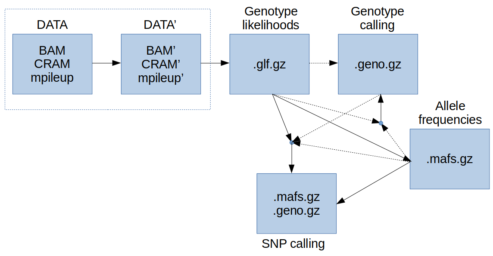
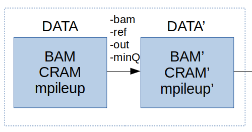
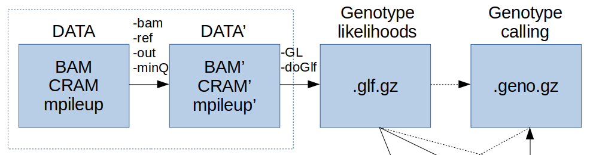
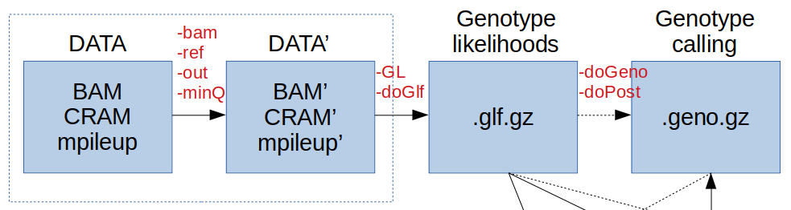

Tutorial 2: Genotype and SNP calling
================

  - [Introduction](#introduction)
  - [Initial preparation](#initial-preparation)
  - [Data filtering and I/O](#data-filtering-and-io)
  - [Genotype likelihoods](#genotype-likelihoods)
  - [Genotype calling](#genotype-calling)
  - [SNP calling and allele
    frequencies](#snp-calling-and-allele-frequencies)

<br> <br>

## Introduction

In this session you will learn how use low-coverage whole genome
sequencing data to do: \* genotype calling \* allele frequency
estimation \* variant (or SNP) calling

We are using the program [ANGSD](http://popgen.dk/wiki/index.php/ANGSD)
(Analysis of Next Generation Sequencing Data). More information about
its rationale and implemented methods can be found
[here](http://www.ncbi.nlm.nih.gov/pubmed/25420514).

According to its website *ANGSD is a software for analyzing next
generation sequencing data. The software can handle a number of
different input types from mapped reads to imputed genotype
probabilities. Most methods take genotype uncertainty into account
instead of basing the analysis on called genotypes. This is especially
useful for low and medium depth data.*

<br>

## Initial preparation

Please make sure to follow these preparatory instructions below before
running these examples. Briefly, you need to set the path to the
software and various data that will be used. Also, you will have to
create two folders on your working directory, one for your results and
one for your intermediate data.

Make sure you have cloned this GitHub repository to your Linux server,
ideally to your home directory, and change your current working
directory to the `tutorial2_genotype_snp_calling folder`. Set this path
as your `BASEDIR`. For example:

``` bash
BASEDIR=~/lcwgs-guide-tutorial/tutorial2_genotype_snp_calling
cd $BASEDIR
```

<br>

Also, you will create a folder in your `BASEDIR` to store your results.

``` bash
mkdir results
```

Let’s set all environment variables

``` bash
DATA=$BASEDIR/bam
REF=$BASEDIR/reference/Ref.fa
ANC=$BASEDIR/reference/outgrp_ref.fa
ANGSD=/programs/angsd0.930/angsd/angsd ## This is the path to ANGSD on Cornell BioHPC servers. Make sure that you change this when running on a different server.
SAMTOOLS=samtools ## This is the path to samtools on Cornell BioHPC servers. Make sure that you change this when running on a different server.
```

We will also need to index the reference file using samtools

``` bash
$SAMTOOLS faidx $REF
```

The **workflow** for this session looks like this



which seems daunting\! However, that’s not the case and we will go
through each step to understand each one of them.

The **workflow** is roughly divided into four steps:

1.  Data filtering and I/O

2.  Genotype likelihoods

3.  Genotype calling

4.  SNP calling

You are now going to learn how to build your first pipeline in ANGSD for
data processing and filtering.

<br>

## Data filtering and I/O

First, we will learn **how to build a command line in ANGSD**.


To see a full list of options in ANGSD type:

``` bash
$ANGSD --help
```

and you should see something like

    ...
    Overview of methods:
        -GL     Estimate genotype likelihoods
        -doCounts   Calculate various counts statistics
        -doAsso     Perform association study
        -doMaf      Estimate allele frequencies
        -doError    Estimate the type specific error rates
        -doAncError Estimate the errorrate based on perfect fastas
        -HWE_pval   Est inbreedning per site or use as filter
        -doGeno     Call genotypes
        -doFasta    Generate a fasta for a BAM file
        -doAbbababa Perform an ABBA-BABA test
        -sites      Analyse specific sites (can force major/minor)
        -doSaf      Estimate the SFS and/or neutrality tests genotype calling
        -doHetPlas  Estimate hetplasmy by calculating a pooled haploid frequency
    
        Below are options that can be usefull
        -bam        Options relating to bam reading
        -doMajorMinor   Infer the major/minor using different approaches
        -ref/-anc   Read reference or ancestral genome
        -doSNPstat  Calculate various SNPstat
        -cigstat    Printout CIGAR stat across readlength
        many others
    
    Output files:
         In general the specific analysis outputs specific files, but we support basic bcf output
        -doBcf      Wrapper around -dopost -domajorminor -dofreq -gl -dovcf docounts
    For information of specific options type: 
        $ANGSD METHODNAME eg 
            $ANGSD -GL
            $ANGSD -doMaf
            $ANGSD -doAsso etc
            $ANGSD sites for information about indexing -sites files
    Examples:
        Estimate MAF for bam files in 'list'
            '$ANGSD -bam list -GL 2 -doMaf 2 -out RES -doMajorMinor 1'

ANGSD can accept several input files, as described
[here](http://popgen.dk/angsd/index.php/Input):

  - BAM, CRAM, mpileup
  - VCF, GLF, beagle

Here we show how ANGSD can also perform some basic filtering of the
data. These filters are based on:

  - quality and depth, see
    [here](http://www.popgen.dk/angsd/index.php/Filters)
  - SNP quality, see [here](http://popgen.dk/angsd/index.php/SnpFilters)
  - sites, see [here](http://popgen.dk/angsd/index.php/Sites)

Have a look at our list of BAM files:

``` bash
cat $BASEDIR/sample_lists/ALL_bams.txt
wc -l $BASEDIR/sample_lists/ALL_bams.txt
ls $BASEDIR/sample_lists/*_bams.txt
```

If the input file is in BAM format, the possible options are:

    $ANGSD -bam
    ...
    parseArgs_bambi.cpp: bam reader:
        -bam/-b     (null)  (list of BAM/CRAM files)
        -i      (null)  (Single BAM/CRAM file)
        -r      (null)  Supply a single region in commandline (see examples below)
        -rf     (null)  Supply multiple regions in a file (see examples below)
        -remove_bads    1   Discard 'bad' reads, (flag >=256) 
        -uniqueOnly 0   Discards reads that doesn't map uniquely
        -show       0   Mimic 'samtools mpileup' also supply -ref fasta for printing reference column
        -minMapQ    0   Discard reads with mapping quality below
        -minQ       13  Discard bases with base quality below
        -trim       0   Number of based to discard at both ends of the reads
        -trim       0   Number of based to discard at 5' ends of the reads
        -trim       0   Number of based to discard at 3' ends of the reads
        -only_proper_pairs 1    Only use reads where the mate could be mapped
        -C      0   adjust mapQ for excessive mismatches (as SAMtools), supply -ref
        -baq        0   adjust qscores around indels (1=normal baq 2= extended(as SAMtools)), supply -ref
        -redo-baq       0 (recompute baq, instead of using BQ tag)
        -checkBamHeaders 1  Exit if difference in BAM headers
        -doCheck    1   Keep going even if datafile is not suffixed with .bam/.cram
        -downSample 0.000000    Downsample to the fraction of original data
        -nReads     50  Number of reads to pop from each BAM/CRAMs
        -minChunkSize   250 Minimum size of chunk sent to analyses
        --ignore-RG 1   (dev only)
        +RG (null)  Readgroups to include in analysis(can be filename)
    
    Examples for region specification:
            chr:        Use entire chromosome: chr
            chr:start-  Use region from start to end of chr
            chr:-stop   Use region from beginning of chromosome: chr to stop
            chr:start-stop  Use region from start to stop from chromosome: chr
            chr:site    Use single site on chromosome: chr

First we need to define input and output files (please note that here we
do not run these intermediate steps, as you can see thare is a `#` in
the front):

    # $ANGSD -b  $BASEDIR/sample_lists/ALL_bams.txt -ref $REF -out $BASEDIR/results/ALL \
    ...

with `-b` we give the file including paths to all BAM files we need to
analyse, `-ref` specifies the reference sequence, `-out` states the
prefix for all output files that will be generated.

Next we need to define some basic filtering options. First we define
filters based on reads quality.

    # $ANGSD -b  $BASEDIR/sample_lists/ALL_bams.txt -ref $REF -out $BASEDIR/results/ALL \
    #        -uniqueOnly 1 -remove_bads 1 -only_proper_pairs 1 -trim 0 -C 50 -baq 1 \
    ...

These filters will retain only uniquely mapping reads, not tagged as
bad, considering only proper pairs, without trimming, and adjusting for
indel/mapping (as in samtools). `-C 50` reduces the effect of reads with
excessive mismatches, while `-baq 1` computes base alignment quality as
explained here ([BAQ](http://samtools.sourceforge.net/mpileup.shtml))
used to rule out false SNPs close to INDELS.

Also, you may want to remove reads with low mapping quality and sites
with low quality or covered by few reads (low depth). Under these
circumstances, the assignment of individual genotypes and SNPs is
problematic, and can lead to errors. We may also want to remove sites
where a fraction (half?) of the individuals have no data. This is
achieved by the `-minInd` option.



<details>

<summary> click here for a possible command line for filtering
</summary>

``` bash
cd $BASEDIR
$ANGSD -b  $BASEDIR/sample_lists/ALL_bams.txt -ref $REF -out $BASEDIR/results/ALL \
       -uniqueOnly 1 -remove_bads 1 -only_proper_pairs 1 -trim 0 -C 50 -baq 1 \
       -minMapQ 20 -minQ 20 -minInd 5 -setMinDepth 7 -setMaxDepth 30 -doCounts 1
```

which corresponds to the following scenario:

    Parameter | Meaning |
    --- | --- |
    -minInd 5 | use only sites with data from at least N individuals |
    -setMinDepth 7 | minimum total depth |
    -setMaxDepth 30 | maximum total depth |

</details>

More sophisticated filtering can be done, but this is outside the scope
of this practical.

You have learnt how to build a basic pipeline in ANGSD. Next you are
going to learn how to calculate genotype likelihoods in ANGSD.

<br>

## Genotype likelihoods


We now wish to calculate the ***genotype likelihoods*** for each site at
each individual.

To do so you need to specify which genotype likelihood model to use.

    $ANGSD -GL
    ...
    -GL=0: 
        1: SAMtools
        2: GATK
        3: SOAPsnp
        4: SYK
        5: phys
        6: Super simple sample an allele type GL. (1.0,0.5,0.0)
        7: outgroup gls
        -trim       0       (zero means no trimming)
        -tmpdir     angsd_tmpdir/   (used by SOAPsnp)
        -errors     (null)      (used by SYK)
        -minInd     0       (0 indicates no filtering)
    
    Filedumping:
        -doGlf  0
        1: binary glf (10 log likes)    .glf.gz
        2: beagle likelihood file   .beagle.gz
        3: binary 3 times likelihood    .glf.gz
        4: text version (10 log likes)  .glf.gz

A description of these different implementation can be found
[here](http://www.popgen.dk/angsd/index.php/Genotype_likelihoods). The
GATK model refers to the first GATK paper, SAMtools is somehow more
sophisticated (non-independence of errors), SOAPsnp requires a reference
sequence for recalibration of quality scores, SYK is error-type
specific. For most applications and data, GATK and SAMtools models
should give similar results.

Let’s first assume we will work with PANY samples only. A possible
command line to calculate genotype likelihoods might be:

<details>

<summary> click here to show it </summary>

``` bash
cd $BASEDIR
$ANGSD -b $BASEDIR/sample_lists/PANY_bams.txt -ref $REF -out $BASEDIR/results/PANY \
        -uniqueOnly 1 -remove_bads 1 -only_proper_pairs 1 -trim 0 -C 50 \
        -minMapQ 20 -minQ 20 -minInd 5 -setMinDepth 7 -setMaxDepth 30 -doCounts 1 \
        -GL 2 -doGlf 4
```

</details>

where we specify: \* -GL 2: genotype likelihood model as in GATK \*
-doGlf 4: output in text format

Ignore the various warning messages. If it is too slow, the add
`-nThreads 10` at the end of the command line. This command should take
around 2 minutes to run.


**QUESTION** What are the output files? What’s the information inside
them?

``` bash
ls $BASEDIR/results/PANY.*
```

<details>

<summary> click here for help </summary>

``` bash
less -S $BASEDIR/results/PANY.arg ## you can press Q to quit less
less -S $BASEDIR/results/PANY.glf.gz ## you can press Q to quit less
```

Have a look at .glf.gz file. The first two columns are the reference
sequence (e.g. chromososome) and position. Then you have 10 likelihoods
for all possible genotypes in the order AA,AC,AG,AT,CC,CG,CT,GG,GT,TT.
This set of 10 likelihoods is repeated sequentially starting from the
left of the file for each individual in the row order of individuals in
the BAM file. The values are log-scaled likelihood ratios, all scaled by
the most likely genotype.

Since the likelihoods have been scaled to the most likely and
log-transformed, the most likely genotype will have a value of 0.

</details>

**BONUS QUESTION** Try to output files in binary format. Which option
should you use? Can you open these files? Look at the file sizes of text
vs binary format. Which one is smaller? Which one would you use?

**BONUS QUESTION** Try to change some filtering options and record the
number of entries in the final output file.

You have learnt how to calculate and read genotype likelihood files. Now
you are going to learn how to perform genotype calling with ANGSD.

## Genotype calling



Here we will explore several ways to call genotypes from sequencing
data. We will also calculate genotypes probabilities to each site for
each individual.

In ANGSD, the option to call genotypes is `-doGeno`:

    $ANGSD -doGeno
    ...
    -doGeno 0
            1: write major and minor
            2: write the called genotype encoded as -1,0,1,2, -1=not called
            4: write the called genotype directly: eg AA,AC etc
            8: write the posterior probability of all possible genotypes
            16: write the posterior probability of called genotype
            32: write the posterior probabilities of the 3 gentypes as binary
            -> A combination of the above can be choosen by summing the values, EG write 0,1,2 types with majorminor as -doGeno 3
            -postCutoff=0.333333 (Only genotype to missing if below this threshold)
            -geno_minDepth=-1       (-1 indicates no cutof)
            -geno_maxDepth=-1       (-1 indicates no cutof)
            -geno_minMM=-1.000000   (minimum fraction af major-minor bases)
            -minInd=0       (only keep sites if you call genotypes from this number of individuals)
    
            NB When writing the posterior the -postCutoff is not used
            NB geno_minDepth requires -doCounts
            NB geno_maxDepth requires -doCounts

Therefore, if we set `-doGeno 2`, genotypes are coded as 0,1,2, as the
number of alternate/minor alleles. If we want to print the major and
minor alleles as well then we set `-doGeno 3`.

To calculate the posterior probability of genotypes we need to define a
model.

    $ANGSD -doPost
    ...
    -doPost 0       (Calculate posterior prob 3xgprob)
            1: Using frequency as prior
            2: Using uniform prior
            3: Using SFS as prior (still in development)
            4: Using reference panel as prior (still in development), requires a site file with chr pos major minor af ac an
    ...

`-doPost 2` uses a uniform prior.

Furthermore, this calculation requires the specification of how to
assign the major and minor alleles (if biallelic).

    $ANGSD -doMajorMinor
    ...
            -doMajorMinor   0
            1: Infer major and minor from GL
            2: Infer major and minor from allele counts
            3: use major and minor from a file (requires -sites file.txt)
            4: Use reference allele as major (requires -ref)
            5: Use ancestral allele as major (requires -anc)
            -rmTrans: remove transitions 0
            -skipTriallelic 0

A typical command for genotype calling is (assuming we analyse our PANY
samples):

``` bash
cd $BASEDIR
$ANGSD -b $BASEDIR/sample_lists/PANY_bams.txt -ref $REF -out $BASEDIR/results/PANY \
    -uniqueOnly 1 -remove_bads 1 -only_proper_pairs 1 -trim 0 -C 50 \
  -minMapQ 20 -minQ 20 -minInd 5 -setMinDepth 7 -setMaxDepth 30 -doCounts 1 \
    -GL 2 -doGlf 1

$ANGSD -glf $BASEDIR/results/PANY.glf.gz -fai $REF.fai -nInd 15 -out $BASEDIR/results/PANY \
    -doMajorMinor 1 -doGeno 3 -doPost 2 -doMaf 1
```

Let’s ignore the `-doMaf` option now. We will discuss it later. This
command should take 1 minute to run.

Have a look at the output file:

``` bash
less -S $BASEDIR/results/PANY.geno.gz
```

The columns are: chromosome, position, major allele, minor allele,
genotypes is 0,1,2 format.

**QUESTION**

How many sites have at least one missing genotype?

``` bash
zcat $BASEDIR/results/PANY.geno.gz | grep -1 - | wc -l
```

How many sites do we have?

<details>

<summary> click here for help </summary>

``` bash
zcat $BASEDIR/results/PANY.geno.gz | wc -l
```

Why is that?

</details>

You can control how to set missing genotype when their confidence is low
with `-postCutoff`. For instance, we can set as missing genotypes when
their (highest) genotype posterior probability is below 0.95:

``` bash
$ANGSD -glf $BASEDIR/results/PANY.glf.gz -fai $REF.fai -nInd 15 -out $BASEDIR/results/PANY \
        -doMajorMinor 1 -doGeno 3 -doPost 2 -doMaf 1 -postCutoff 0.95
```

How many sites do we have in total? How many sites have at least one
missing genotype now?

<details>

<summary> click here for help </summary>

``` bash
zcat $BASEDIR/results/PANY.geno.gz | wc -l
zcat $BASEDIR/results/PANY.geno.gz | grep -1 - | wc -l
```

</details>

Why are there some many sites with missing genotypes?

The mean depth per sample is around 1-2X, therefore genotypes cannot be
assigned with very high confidence. Sites where all genotypes are
missing are skipped in the output file.

Setting this threshold depends on the mean sequencing depth of your
data, as well as your application. For some analyses you need to work
only with high quality genotypes (e.g. measure of proportion of shared
SNPs for gene flow estimate), while for others you can be more relaxed
(e.g. estimate of overall nucleotide diversity). We will show later how
to accurately estimate summary statistics with low-depth data.

**BONUS QUESTION** Try to set the threshold on -postCutoff to 0.50. How
many sites do you retrieve? Why? Which value would you choose?



-----

**EXERCISE**

If we assume HWE, then we can use this information as prior probability
to calculate genotype posterior probabilities. The command line would
be:

``` bash
$ANGSD -glf $BASEDIR/results/PANY.glf.gz -fai $REF.fai -nInd 15 -out $BASEDIR/results/PANY \
        -doMajorMinor 1 -doGeno 3 -doPost 1 -doMaf 1
```

using the option `-doPost 1`.

In ANGSD we can restrict our analyses on a subset of positions of
interest using the `-sites` option. The file with these positions need
to be formatted as (chromosome positions).

``` bash
echo Mme_chr24:2558528-4558528 48 > $BASEDIR/results/snp.txt
echo Mme_chr24:2558528-4558528 61 >> $BASEDIR/results/snp.txt
```

We need to index this file in order for ANGSD to process it.

``` bash
$ANGSD sites index $BASEDIR/results/snp.txt
```

We are interested in calculating the derived allele frequencies, so are
using the ancestral sequence to polarise the alleles. We also want to
compute the allele frequencies for each population separately. We need
to use a different file for each population, with a different list of
BAM files, as provided:

``` bash
cd $BASEDIR/sample_lists
ls -d -1 *_bams.txt
```

    ALL_bams.txt
    JIGA_bams.txt
    MAQU_bams.txt
    MBNS_bams.txt
    PANY_bams.txt

We retain only these populations: Jekyll Island (JIGA), Patchogue
(PANY), Minas Basin (MBNS), Magdalen Island (MBNS).

We are calculating the **derived** allele frequencies based on assigned
genotypes for each population at these two positions. We have to specify
a putative ancestral sequence, with the variable `$ANC`.

Write the code that performs the following genotype calling for our
variants of interest in all populations. Also, you can directly call
genotypes without generating the genotype likelihood files, by starting
from bam files directly. As an indication, you can follow these
guidelines: - use the SAMtools genotype likelihood model - calculate
genotype posterior probabilities using a HWE-based prior - filter out
bases with a quality score less than 20 - filter our reads with a
mapping quality score less than 20 - use ony sites where you have at
least five samples with data (-mindInd) - do not set any filtering based
on min and max depth - use -doMajorMinor 5 (try to understand why) and
-doMaf 1 options - set genotypes as missing if the highest genotype
probability is less than 0.50 - use option `-sites Data/snp.txt` to
restrict the analysis only on selected sites but feel free to choose
some parameters yourself.

    ...

Once done, open the output files and calculate the derived allele
frequency by counting genotypes. What is the derived allele frequency
for each population for each site?

Can you comment these results? Do you see any allele frequency
differentiation in the derived state by counting genotypes?

If you don’t obtain an output, it means that for these loci there is no
data. Try to run the calculation on the whole data set and pick one site
with data for counting genotypes, if you wish so.

You have now learnt how to call genotypes with ANGSD and appreciated the
effect of data uncertainty. You are now going to learn how to perform
SNP calling and estimation of allele frequencies.

## SNP calling and allele frequencies


We now want to estimate allele frequencies at each site without relying
on genotype calls. In other words, at each site we want to to estimate
(or count) how many copies of different alleles (two in case of
biallelic variants) we observe in our sample (across all sequenced
individuals). However with low depth data direct counting of
individually assigned genotypes can lead to biased allele frequencies.

ANGSD has an option to estimate **allele frequencies** taking into
account data uncertainty from genotype likelihoods:

    $ANGSD -doMaf
    ...
    -doMaf  0 (Calculate persite frequencies '.mafs.gz')
            1: Frequency (fixed major and minor)
            2: Frequency (fixed major unknown minor)
            4: Frequency from genotype probabilities
            8: AlleleCounts based method (known major minor)
            NB. Filedumping is supressed if value is negative
    -doPost 0       (Calculate posterior prob 3xgprob)
            1: Using frequency as prior
            2: Using uniform prior
            3: Using SFS as prior (still in development)
            4: Using reference panel as prior (still in development), requires a site file with chr pos major minor af ac an
    Filters:
            -minMaf         -1.000000       (Remove sites with MAF below)
            -SNP_pval       1.000000        (Remove sites with a pvalue larger)
            -rmTriallelic   0.000000        (Remove sites with a pvalue lower)
    Extras:
            -ref    (null)  (Filename for fasta reference)
            -anc    (null)  (Filename for fasta ancestral)
            -eps    0.001000 [Only used for -doMaf &8]
            -beagleProb     0 (Dump beagle style postprobs)
            -indFname       (null) (file containing individual inbreedcoeficients)
            -underFlowProtect       0 (file containing individual inbreedcoeficients)
    NB These frequency estimators requires major/minor -doMajorMinor

Therefore, the estimation of allele frequencies requires the
specification of how to assign the major and minor alleles (if
biallelic).

    $ANGSD -doMajorMinor
    ...
            -doMajorMinor   0
            1: Infer major and minor from GL
            2: Infer major and minor from allele counts
            3: use major and minor from a file (requires -sites file.txt)
            4: Use reference allele as major (requires -ref)
            5: Use ancestral allele as major (requires -anc)
            -rmTrans: remove transitions 0
            -skipTriallelic 0

A possible command line to estimate allele frequencies might be (this
may take 1 min to run):

``` bash
$ANGSD -b $BASEDIR/sample_lists/PANY_bams.txt -ref $REF -out $BASEDIR/results/PANY \
        -uniqueOnly 1 -remove_bads 1 -only_proper_pairs 1 -trim 0 -C 50 \
        -minMapQ 20 -minQ 20 -minInd 5 -setMinDepth 7 -setMaxDepth 30 -doCounts 1 \
        -GL 1 -doGlf 1 -doMajorMinor 1 -doMaf 1
```

where we specify: \* -doMajorMinor 1: both alleles are inferred from
genotype likelihoods \* -doMaf 1: major and minor are fixed

**QUESTION** What are the output files?

  - “$BASEDIR/results/PANY.arg”
  - “$BASEDIR/results/PANY.mafs.gz”

`.args` file is a summary of all options used, while `.mafs.gz` file
shows the allele frequencies computed at each site.

Have a look at this file which contains estimates of allele frequencies.

``` bash
zcat $BASEDIR/results/PANY.mafs.gz | head
```

and you may see something like

    chromo  position    major   minor   ref knownEM nInd
    Mme_chr24:2558528-4558528   27  A   C   A   0.000004    5
    Mme_chr24:2558528-4558528   28  T   A   T   0.000004    5
    Mme_chr24:2558528-4558528   29  T   A   T   0.000004    5
    Mme_chr24:2558528-4558528   30  T   A   T   0.000004    5
    Mme_chr24:2558528-4558528   31  A   C   A   0.000004    5
    Mme_chr24:2558528-4558528   32  T   A   T   0.000004    5
    Mme_chr24:2558528-4558528   35  C   A   C   0.000004    5
    Mme_chr24:2558528-4558528   38  A   C   A   0.000004    5
    Mme_chr24:2558528-4558528   39  T   A   T   0.000004    6

where `knownEM` specifies the algorithm used to estimate the allele
frequency which is given under that column. Please note that this refers
to the allele frequency of the allele labelled as `minor`. The columns
are: chromosome, position, major allele, minor allele, reference allele,
allele frequency, p-value for SNP calling (if -SNP-pval was called),
number of individuals with data. The last column gives the number of
samples with data (you can see that this never below 5 given our
filtering).

You can notice that many sites have low allele frequency, probably
reflecting the fact that that site is monomorphic. We may be interested
in looking at allele frequencies only for sites that are actually
variable in our sample. Therefore we want to perform a **SNP calling**.

There are two main ways to call SNPs using ANGSD with these options:

``` 
        -minMaf         0.000000        (Remove sites with MAF below)
        -SNP_pval       1.000000        (Remove sites with a pvalue larger)
```

Therefore we can consider assigning as SNPs sites whose estimated allele
frequency is above a certain threhsold (e.g. the frequency of a
singleton) or whose probability of being variable is above a specified
value.

**QUICK EXERCISE**

As an illustration, call SNPs by computing: - genotype likelihoods using
GATK method; - major and minor alleles inferred from genotype
likelihoods; - frequency from known major allele but unknown minor; -
SNPs as those having MAF=\>0.05.

Try to write down this command by yourself and comment the results.

    ...

As a general guidance, `-GL 1`, `-doMaf 1/2` and `-doMajorMinor 1`
should be the preferred choice when data uncertainty is high. However,
when working with multiple populations `-doMajorMinor 1` is not suitable
as you need to ensure that each site is polarised in the same way among
different populations. Therefore, in these conditions, it is better to
use option 4 or 5. If interested in analysing very low frequency SNPs,
then `-doMaf 2` should be selected. When accurate information on
reference sequence or outgroup are available, one can use
`-doMajorMinor` to 4 or 5. Also, detecting variable sites based on their
probability of being SNPs is generally a better choice than defining a
threshold on the allele frequency. However, various cutoffs and a
dedicated filtering should be perform to assess robustness of your
called SNPs.


**QUICK EXERCISE**

Try varying the cutoff for SNP calling and record how many sites are
predicted to be variable for each scenario. Identify which sites are not
predicted to be variable anymore with a more stringent cutoff
(e.g. between a pair of scenario), and plot their allele frequencies.
Use the previously calculated genotype likelihoods as input file (add
proper values for `-glf ? -fai ? -nInd ?`).

<details>

<summary> click here for help </summary>

``` bash
# iterate over some cutoffs (you can change these)
for PV in 0.05 1e-2 1e-4 1e-6
do
        if [ $PV == 0.05 ]; then echo SNP_pval NR_SNPs; fi
        $ANGSD -glf ? -nInd 15 -fai ? -out $BASEDIR/results/PANY.$PV \
                -doMajorMinor 1 -doMaf 1 -skipTriallelic 1 \
                -SNP_pval $PV &> /dev/null
        echo $PV `zcat $BASEDIR/results/PANY.$PV.mafs.gz | tail -n+2 | wc -l`
done
```

</details>

A possible output is (your numbers may be different):

    SNP_pval NR_SNPs
    0.05 23052
    1e-2 16630
    1e-4 9198
    1e-6 6348

Which sites differ from 0.05 and 0.01? What is their frequency? This
script will also print out the first 20 discordant sites (pK.EM is the
p-value for the SNP calling test).

``` bash
Rscript -e 'mafs1 <- read.table(gzfile("$BASEDIR/results/PANY.1e-2.mafs.gz"), he=T, row.names=NULL, strings=F); mafs5 <- read.table(gzfile("$BASEDIR/results/PANY.0.05.mafs.gz"), header=T, row.names=NULL, stringsAsFact=F); mafs5[!(mafs5[,2] %in% mafs1[,2]),][1:20,]; pdf(file="$BASEDIR/results/diffSnpCall.pdf"); par(mfrow=c(1,2)); hist(as.numeric(mafs5[!(mafs5[,2] %in% mafs1[,2]),][,6]), main="Discordant SNPs", xlab="MAF", xlim=c(0,0.5)); hist(as.numeric(mafs5[(mafs5[,2] %in% mafs1[,2]),][,6]), main="Concordant SNPs", xlab="MAF", xlim=c(0,0.5)); dev.off();'
```

You can scp the pdf file to your local machine (from your local machine:
scp -i XYZ.pem <userX@IP>:\~/day2/$BASEDIR/results/diffSnpCall.pdf .)
and visualise it with

``` bash
evince $BASEDIR/results/diffSnpCall.pdf
```

What can you conclude from these results? Which frequencies are more
difficult to estimate and therefore affect SNP calling?

-----

**EXERCISE**

Estimate derived allele frequencies for all populations of interest
using a likelihood approach, without relying on genotype calls. What is
the difference compared to what previously estimated by counting
genotypes?

-----

You are now able to calculate genotype likelihoods and allele
frequencies and perform genotype and SNP calling with ANGSD.
