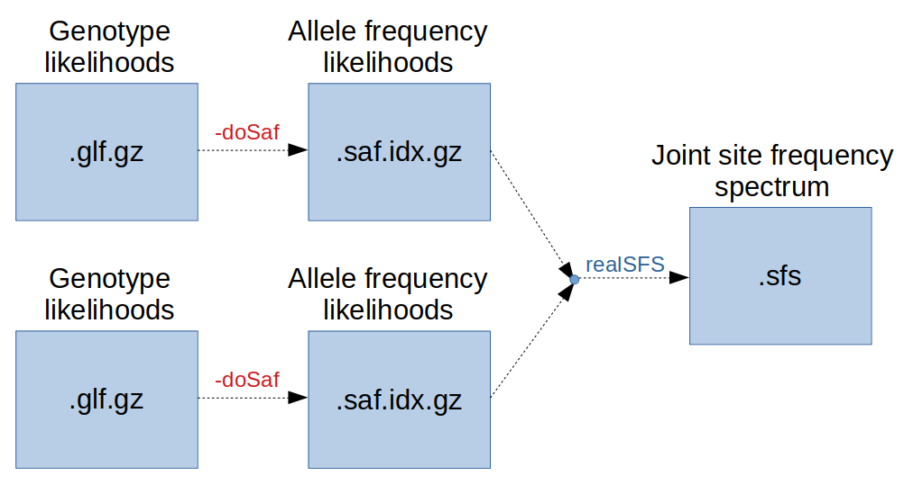

Tutorial 4: Summary statistics
================

<br>

Here you will learn how to perform a scan for positive selection by calculating several summary statistics in windows from low-depth NGS data.

Specifically, you will learn how to estimate:

1. site frequency spectrum
2. population genetic differentiation
3. nucleotide diversity

<br>

# Initial preparation

Please make sure to follow these preparatory instructions below before running these examples. You need to set the path to the software and various data that will be used. Also, you will have to create two new folders in your `day4` working directory, one for your results and one for your intermediate data.
```
cd ~
mkdir day4
```

First go to the day4 directory and create subdirectories for data and results:
```
cd day4
mkdir Results
mkdir Data
```

And then we set all the rest of the paths:
```
DIR=/home/ubuntu/Share/data
DATA=$DIR/BAMS
REF=$DIR/Ref.fa
ANC=$DIR/outgrp_ref.fa
```

# Today’s data

As outlined in the previous exercises, we are working with low-coverage NGS data for 60 Atlantic silversides from the following 4 populations:


These populations have been previously studied in [Therkildsen et al. 2019](https://science.sciencemag.org/content/365/6452/487) and [Wilder et al. 2020](https://onlinelibrary.wiley.com/doi/10.1002/evl3.189), and cover the entire distribution range of the species.

Our NGS data are in bam format and span a 2Mb region on chromosome 24. The interesting aspect about chromosome 24 is that it harbours a large polymorphic inversion that differs in its frequency across populations. 
The test dataset spans one breakpoint of this inversion (1Mb up and downstream).

Here we see how to compute the 2D-SFS, FST, PBS, and other summary statistics from low-depth data using ANGSD to understand patterns of divergence and differentiation across the genome.

Our final goal is to detect signatures of selection in our data.


<br>


-----------------------------

#### 1. Site frequency spectrum

One of the most important aspect of data analysis for population genetics is the estimate of the Site Frequency Spectrum (SFS).
SFS records the proportions of sites at different allele frequencies. It can be folded or unfolded, and the latter case implies the use of an outgroup species to define the ancestral state.
SFS is informative on the demography of the population or on selective events (when estimated at a local scale).

We use ANGSD to estimate SFS using on example dataset, using the methods described [here](http://www.ncbi.nlm.nih.gov/pubmed/22911679).
Details on the implementation can be found [here](http://popgen.dk/angsd/index.php/SFS_Estimation).
Briefly, from sequencing data one computes genotype likelihoods (as previously described).
From these quantities ANGSD computes posterior probabilities of Sample Allele Frequency (SAF), for each site.
Finally, an estimate of the SFS is computed.

These steps can be accomplished in ANGSD using `-doSaf 1/2` options and the program `realSFS`.


```
angsd -doSaf
...
-doSaf		0
	1: perform multisample GL estimation
	2: use an inbreeding version
	3: calculate genotype probabilities (use -doPost 3 instead)
	4: Assume genotype posteriors as input (still beta) 
	-doThetas		0 (calculate thetas)
	-underFlowProtect	0
	-fold			0 (deprecated)
	-anc			(null) (ancestral fasta)
	-noTrans		0 (remove transitions)
	-pest			(null) (prior SFS)
	-isHap			0 (is haploid beta!)
	-doPost			0 (doPost 3,used for accesing saf based variables)
NB:
	  If -pest is supplied in addition to -doSaf then the output will then be posterior probability of the sample allelefrequency for each site
```

The SFS is typically computed for each population separately. 

We cycle across all populations and compute SAF files. By specifying an outgroup genome using the `-anc $ANC` option, we can polarize the sample allele frequencies and estimate the derived allele frequency. This will allow us to later compute the unfolded site frequency spectrum.
```
for POP in JIGA PANY MBNS MAQU
do
        echo $POP
        angsd -b $DIR/$POP'_bams.txt' -ref $REF -anc $ANC -out Results/$POP \
                -uniqueOnly 1 -remove_bads 1 -only_proper_pairs 1 -trim 0 -C 50 \
                -minMapQ 20 -minQ 20 -minInd 5 -setMinDepth 5 -setMaxDepth 60 -doCounts 1 \
                -GL 1 -doSaf 1
done
```
Please ignore various warning messages.
This command should take around 3 minutes to run.

Look at the results.
```
realSFS print Results/PANY.saf.idx | less -S  
```
These values represent the sample allele frequency likelihoods at each site, as seen during the lecture.
So the first value (after the chromosome and position columns) is the likelihood of having 0 copies of the derived allele, the second indicates the probability of having 1 copy and so on.
Note that these values are in log format and scaled so that the maximum is 0.

**QUESTION**
How many columns do we have? Why?

**QUESTION**
Can you spot any site which is likely to be variable (i.e. polymorphic)?
Can you spot any fixed site for the derived allele?

SNPs are represented by sites where the highest likelihood does not correspond to allele frequencies of 0 or 100%.

The next step would be to use these likelihoods and estimate the overall SFS.
This is achieved by the program `realSFS`.
```
realSFS
-> ---./realSFS------
	-> EXAMPLES FOR ESTIMATING THE (MULTI) SFS:

	-> Estimate the SFS for entire genome??
	-> ./realSFS afile.saf.idx 

	-> 1) Estimate the SFS for entire chromosome 22 ??
	-> ./realSFS afile.saf.idx -r chr22 

	-> 2) Estimate the 2d-SFS for entire chromosome 22 ??
	-> ./realSFS afile1.saf.idx  afile2.saf.idx -r chr22 

	-> 3) Estimate the SFS for the first 500megabases (this will span multiple chromosomes) ??
	-> ./realSFS afile.saf.idx -nSites 500000000 

	-> 4) Estimate the SFS around a gene ??
	-> ./realSFS afile.saf.idx -r chr2:135000000-140000000 

	-> Other options [-P nthreads -tole tolerence_for_breaking_EM -maxIter max_nr_iterations -bootstrap number_of_replications]

	-> See realSFS print for possible print options
	-> Use realSFS print_header for printing the header
	-> Use realSFS cat for concatenating saf files

	->------------------
	-> NB: Output is now counts of sites instead of log probs!!
	-> NB: You can print data with ./realSFS print afile.saf.idx !!
	-> NB: Higher order SFSs can be estimated by simply supplying multiple .saf.idx files!!
	-> NB: Program uses accelerated EM, to use standard EM supply -m 0 
	-> Other subfunctions saf2theta, cat, check, dadi
```

Therefore, this command will estimate the SFS for each population separately:
```
for POP in JIGA PANY MBNS MAQU
do
        echo $POP
        realSFS Results/$POP.saf.idx > Results/$POP.sfs
done
```
The output will be saved in `Results/POP.sfs` files.

You can now have a look at the output file, for instance for the JIGA samples:
```
cat Results/JIGA.sfs
```
The first value represents the **expected** number of sites with derived allele frequency equal to 0, the second column the expected number of sites with frequency equal to 1 and so on.

**QUESTION**
How many values do you expect?
```
awk -F' ' '{print NF; exit}' Results/JIGA.sfs
```

Indeed this represents the unfolded spectrum, so it has `2N+1` values with N diploid individuals.

Why is it so bumpy?

The maximum likelihood estimation of the SFS should be performed at the whole-genome level to have enough information.
However, for practical reasons, here we could not use large genomic regions.
Also, as we will see later, this region is not really a proxy for neutral evolution so the SFS is not expected to behave neutrally for some populations.
Nevertheless, these SFS should be a reasonable prior to be used for estimation of summary statistics.


<br>

Optionally, one can even plot the SFS for each pop using this simple R script:.
```
R # to open R

sfs<-scan("Results/JIGA.sfs")
pdf("Results/JIGA_sfs.pdf")
barplot(sfs)
dev.off()

sfs<-scan("Results/PANY.sfs")
pdf("Results/PANY_sfs.pdf")
barplot(sfs)
dev.off()

sfs<-scan("Results/MBNS.sfs")
pdf("Results/MBNS_sfs.pdf")
barplot(sfs)
dev.off()

sfs<-scan("Results/MAQU.sfs")
pdf("Results/MAQU_sfs.pdf")
barplot(sfs)
dev.off()

q() # to close R
```
It's also convenient to mask the bin corresponding to a frequecy of 0.
```
R # to open R

sfs<-scan("Results/JIGA.sfs")
pdf("Results/JIGA_sfs2.pdf")
barplot(sfs[-1])
dev.off()

sfs<-scan("Results/PANY.sfs")
pdf("Results/PANY_sfs2.pdf")
barplot(sfs[-1])
dev.off()

sfs<-scan("Results/MBNS.sfs")
pdf("Results/MBNS_sfs2.pdf")
barplot(sfs[-1])
dev.off()

sfs<-scan("Results/MAQU.sfs")
pdf("Results/MAQU_sfs2.pdf")
barplot(sfs[-1])
dev.off()

q() # to close R
```

You can copy these files to your own local machine and open them (scp -i XXX.pem XXX@IP:~/day4/Results/*.pdf .)

<br>

**QUESTION**
Do they behave like expected?
Which population has more SNPs?
Which population has a higher proportion of common (not rare) variants?

<br>


---------------------------------------


**Optional: The folded minor allele frequency spectrum**
If you do not have an outgroup genome, you can compute the folded site frequency spectrum by estimating sample allele frequencies by specifying the reference genome as the ancestral genome: 
```
for POP in JIGA PANY MBNS MAQU
do
        echo $POP
        angsd -b $DIR/$POP'_bams.txt' -ref $REF -anc $REF -out Results/$POP.folded \
                -uniqueOnly 1 -remove_bads 1 -only_proper_pairs 1 -trim 0 -C 50 \
                -minMapQ 20 -minQ 20 -minInd 5 -setMinDepth 5 -setMaxDepth 50 -doCounts 1 \
                -GL 1 -doSaf 1
done
```

and then compute the overall folded SFS by specifying the `-fold 1` option as part of the `realSFS` command:
```
for POP in JIGA PANY MBNS MAQU
do
        echo $POP
        realSFS Results/$POP.folded.saf.idx -fold 1 > Results/$POP.folded.sfs
done
```

**QUESTION**
How does the folded spectrum differ from the unfolded SFS?
How many non-zero values do you have now?
```
# for instance
cat Results/PANY.folded.sfs
```

---------------------------------------

**VERY OPTIONAL** (which means you should ignore this)

It is sometimes convenient to generate bootstrapped replicates of the SFS, by sampling with replacements genomic segments.
This could be used for instance to get confidence intervals when using the SFS for demographic inferences.
This can be achieved in ANGSD using:
```
realSFS Results/JIGA.saf.idx -bootstrap 10  2> /dev/null > Results/JIGA.boots.sfs
cat Results/JIGA.boots.sfs
```
This command may take some time.
The output file has one line for each boostrapped replicate.


<br>


---------------------------------------

Secondly, we need to estimate a **multi-dimensional SFS**, for instance the joint SFS between 2 populations (2D).
This can be used for making inferences on their divergence process (time, migration rate and so on).
However, here we are interested in estimating the 2D-SFS as prior information for our FST/PBS.



An important issue when doing this is to be sure that we are comparing the exactly same corresponding sites between populations.
ANGSD does that automatically and considers only a set of overlapping sites.

We assume JIGA being the targeted population, and MAQU and MBNS reference populations.
All 2D-SFS between such populations and MAQU are computed with:
```
POP2=JIGA
for POP in MAQU MBNS
do
        echo $POP
        realSFS Results/$POP.saf.idx Results/$POP2.saf.idx > Results/$POP.$POP2.sfs
done

# we also need the comparison between MAQU and MBNS 
realSFS Results/MAQU.saf.idx Results/MBNS.saf.idx > Results/MAQU.MBNS.sfs
```
This command will take some time. 

The output file is a flatten matrix, where each value is the count of sites with the corresponding joint frequency ordered as [0,0] [0,1] and so on.
```
less -S Results/MAQU.JIGA.sfs
```

**VERY VERY OPTIONAL**
You can even estimate SFS with higher order of magnitude.
This command may take a lot of time and you should skip it if not interested.
```
realSFS Results/JIGA.saf.idx Results/MBNS.saf.idx Results/MAQU.saf.idx > Results/JIGA.MBNS.MAQU.sfs
```

<br>

You have now learnt how to estimate 1D and 2D site frequency spectra with ANGSD from low-coverage data without genotype calling.
In the next session you will see how we can use this information to estimate summary statistics, starting from FST.

[click here](https://github.com/nt246/lcwgs-guide-tutorial/blob/main/tutorial4_selection/markdowns/02_fst.md) to move to the next session.

------------------------------------


